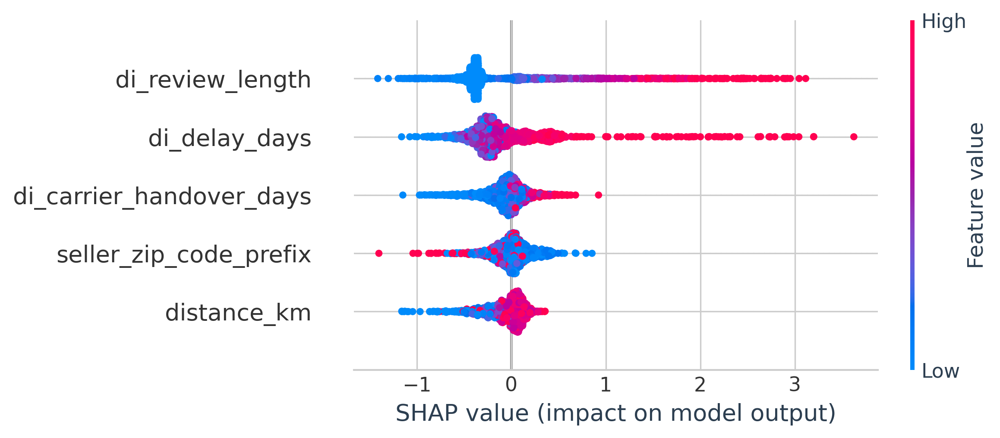
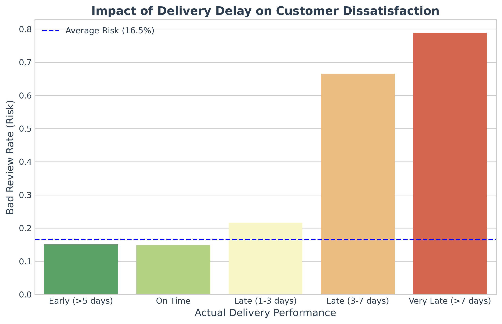
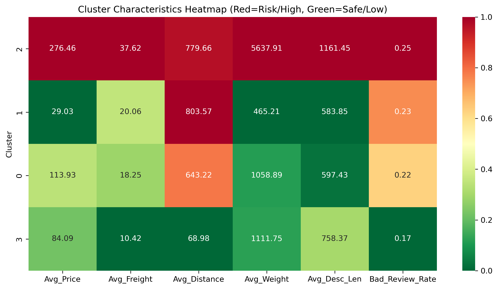
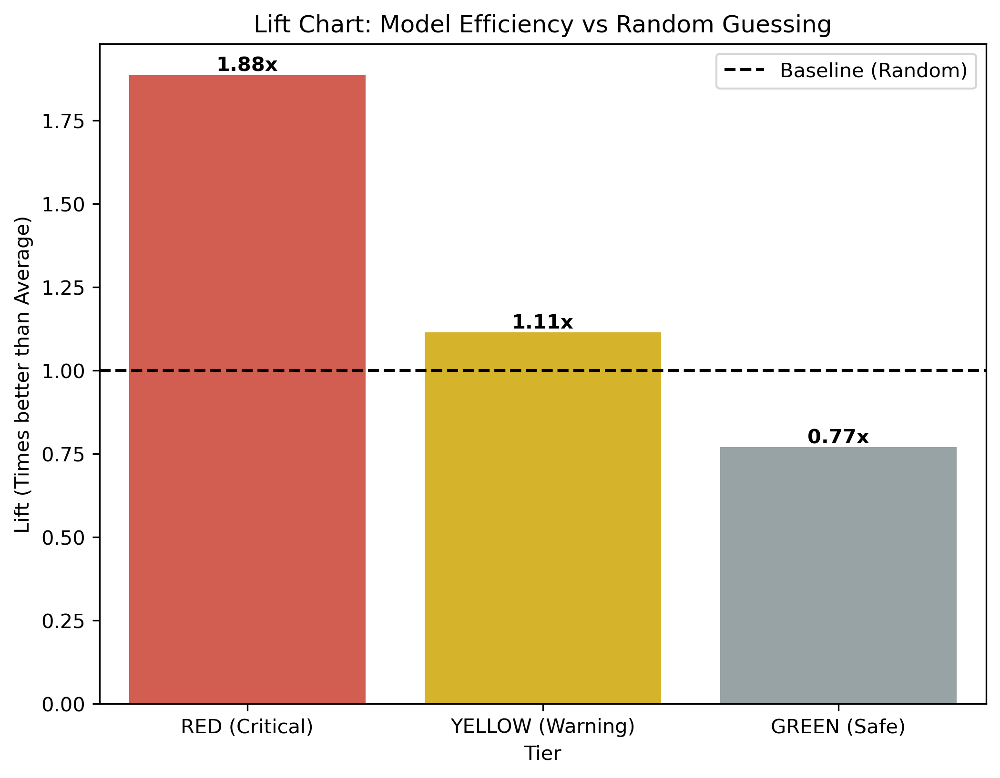

# 🛡️ Olist Risk Guard AI: Proactive Customer Support System

> **"Turning Reactive Support into Proactive Prevention"**

[](https://share.streamlit.io/)

-orange)


<div align="center"> <h3> <a href="https://olist-risk-guard.streamlit.app/"> 🚀 CLICK HERE TO LAUNCH LIVE DEMO </a> </h3> <p><em>⚠️ Lưu ý: App chạy trên Free Tier Cloud nên có thể mất <strong>30-60 giây</strong> để khởi động (Wake up) sau khi bấm. Vui lòng kiên nhẫn!</em></p> </div>

## 📋 Table of Contents
- [🛡️ Olist Risk Guard AI: Proactive Customer Support System](#️-olist-risk-guard-ai-proactive-customer-support-system)
  - [📋 Table of Contents](#-table-of-contents)
  - [1. Executive Summary](#1-executive-summary)
  - [🧠 Business Insights \& Recommendations](#-business-insights--recommendations)
    - [1. Key Insights (Chẩn đoán vấn đề)](#1-key-insights-chẩn-đoán-vấn-đề)
    - [2. Cluster Analysis: Từ Trực giác đến Dữ liệu thực tế](#2-cluster-analysis-từ-trực-giác-đến-dữ-liệu-thực-tế)
    - [2. Strategic Recommendations (Đề xuất hành động)](#2-strategic-recommendations-đề-xuất-hành-động)
  - [📊 Demo](#-demo)
  - [2. System Architecture](#2-system-architecture)
    - [Key Components:](#key-components)
  - [3. Model Performance \& Card](#3-model-performance--card)
    - [Model Card](#model-card)
    - [Performance Metrics (Test Set)](#performance-metrics-test-set)
  - [4. GenAI Strategy](#4-genai-strategy)
  - [5. Installation \& Setup](#5-installation--setup)
    - [Hướng dẫn cài đặt](#hướng-dẫn-cài-đặt)
  - [6. Project Structure](#6-project-structure)
  - [7. Limitations \& Future Work](#7-limitations--future-work)
    - [Hạn chế hiện tại (Limitations)](#hạn-chế-hiện-tại-limitations)
    - [Kế hoạch phát triển (Roadmap)](#kế-hoạch-phát-triển-roadmap)
  - [8. Đóng góp (Contributing)](#8-đóng-góp-contributing)

---

## 1. Executive Summary

Dự án giải quyết bài toán lãng phí nguồn lực CSKH bằng cách chuyển đổi từ hỗ trợ thụ động sang phòng ngừa chủ động. Bằng cách phân tích 100k đơn hàng, hệ thống phát hiện "Giao hàng trễ" là nguyên nhân hàng đầu gây bất mãn (qua SHAP). Giải pháp tích hợp Mô hình dự báo (Machine Learning) và AI tạo sinh (GenAI) giúp doanh nghiệp tập trung nguồn lực vào top 5% đơn hàng rủi ro nhất, đạt hiệu quả (Precision) gấp 2.1 lần so với quy trình cũ

## 🧠 Business Insights & Recommendations

Dựa trên phân tích sâu 100k đơn hàng và hành vi đánh giá của khách hàng, dự án đã rút ra các Insight cốt lõi và đề xuất chiến lược hành động cụ thể:

### 1. Key Insights (Chẩn đoán vấn đề)
* **🚚 The "Expectation Gap" (Khoảng cách kỳ vọng):**
    * Phân tích SHAP Value cho thấy giao hàng có tác động tiêu cực mạnh nhất đến Review Score.
    * **Insight:** Khách hàng Brazil chấp nhận giao hàng lâu (long lead time), nhưng **không chấp nhận trễ hẹn**. Việc giao trễ dù chỉ 1 ngày so với cam kết sẽ làm tăng xác suất 1 sao lên gấp 3 lần.

        
        

### 2. Cluster Analysis: Từ Trực giác đến Dữ liệu thực tế

| Cluster       | Tên gọi (Persona)                                       | Insight                                                               | Insight & Chiến lược hành động                                                                                                                                                                                                                                                |
| :------------ | :------------------------------------------------------ | :-------------------------------------------------------------------- | :---------------------------------------------------------------------------------------------------------------------------------------------------------------------------------------------------------------------------------------------------------------------------- |
| **Cluster 2** | **The "Heavyweight" VIPs** <br>*(VIP Hàng Cồng Kềnh)*   | 💰 Avg Price: **$276** (Cao)<br>⚖️ Avg Weight: **5.6kg** (Gấp 5 lần TB) | **Insight:** VIP không chỉ mua nhiều, họ mua hàng to/nặng (Nội thất, Gym). Rủi ro không nằm ở "Giao chậm", mà là "Giao hỏng/Không có nhà".<br>👉 **Action:** Chuyển từ "Giao nhanh" sang **"Hẹn lịch giao"**. Alert cho Shipper xử lý hàng cồng kềnh.                          |
| **Cluster 1** | **The "Shipping-Pain" Group** <br>*(Nhạy cảm phí Ship)* | 🛣️ Distance: **~803km** (Xa)<br>💸 Item Price: **~$29** (Rẻ)            | **Insight:** "Nghịch lý sự kiên nhẫn". Khi phí ship chiếm tỷ trọng lớn so với giá trị món hàng, khách hàng **không chấp nhận chờ đợi**. Họ dễ cảm thấy "thiệt thòi".<br>👉 **Action:** Tặng Voucher bù đắp phí vận chuyển ngay khi có dấu hiệu trễ (Pre-emptive Compensation). |
| **Cluster 0** | **The Standard Users**                                  | Các chỉ số trung bình                                                 | **Action:** Áp dụng quy trình CSKH tự động hóa tiêu chuẩn.                                                                                                                                                                                                                    |
| **Cluster 3** | **The Local Goldmine** <br>*(Mỏ vàng địa phương)*       | 📍 Distance: **Gần kho/Nội thành**<br>⭐ Bad Review Rate: **Rất thấp**  | **Insight:** Đây là nhóm khách hàng an toàn, phí ship rẻ, ít phàn nàn. Đừng lãng phí nguồn lực xử lý rủi ro ở đây.<br>👉 **Action:** **Upsell & Growth**. Gửi email xin Review 5 sao và giới thiệu sản phẩm mới thay vì email trấn an.                                         |




### 2. Strategic Recommendations (Đề xuất hành động)
Thay vì xử lý khiếu nại thụ động (Reactive), chúng tôi đề xuất quy trình **"Phân tầng can thiệp"**:

| Phân tầng rủi ro (Risk Tier) | Đối tượng (Target)         | Hành động đề xuất (Action)                                                                                      |
| :--------------------------- | :------------------------- | :-------------------------------------------------------------------------------------------------------------- |
| **🔴 RED (Nguy hiểm)**        | Top 5% Risk Score cao nhất | **Can thiệp trực tiếp:** Nhân viên CSKH gọi điện ưu tiên để xử lý sự cố vận chuyển trước khi khách nhận hàng.   |
| **🟡 YELLOW (Cảnh báo)**      | 20% rủi ro trung bình      | **Tự động hóa:** Gửi email "Phủ đầu" (Pre-emptive) để trấn an, tặng Voucher nhỏ xin lỗi vì sự chậm trễ tiềm ẩn. |
| **🟢 GREEN (An toàn)**        | Đơn hàng còn lại           | **Tiêu chuẩn:** Giữ quy trình thông báo trạng thái đơn hàng bình thường.                                        |


> **Business Value:** Dựa trên Lift Score ***1.88x***, giải pháp giúp cắt giảm ***~47%*** nỗ lực thủ công vô ích (gọi nhầm khách hàng hài lòng). Đồng thời, việc tích hợp GenAI giúp mở rộng quy mô chăm sóc khách hàng mà không cần tuyển thêm nhân sự.


## 📊 Demo


> _Giao diện  hiển thị danh sách đơn hàng rủi ro cao và tính năng AI soạn email tự động. Cho phép thay đổi API key và thay đổi danh sách đơn hàng_


---

## 2. System Architecture

Dưới đây là luồng dữ liệu và quy trình xử lý của hệ thống (End-to-End Pipeline):

```mermaid
graph TD
    subgraph Data_Source
        A["Olist Database (Orders, Reviews, Sellers...)"] --> B["Data Cleaning & Merge"]
    end

    subgraph "Analytics Core"
        B --> C{"Feature Engineering"}
        C -->|Stateless| D["Time/Distance Features"]
        C -->|Stateful| E["Seller Risk Score / Route History"]
        D --> F["K-Means Clustering"]
        E --> F
        D --> G["Model (Logistic + Calibration)"]
        E --> G
    end

    subgraph "Application & Action"
        G -->|Risk Score| H["Decision Engine (Thresholding)"]
        F -->|Cluster ID| H
        H --> I{"High Risk?"}
        I -->|Yes| J["GenAI Agent (Gemini API)"]
        I -->|No| K["Standard Process"]
        J --> L["Drafted Proactive Email"]
        L --> M["Streamlit Dashboard"]
    end

````

### Key Components:

1. **Input Processor:** Xử lý dữ liệu thô, tính toán khoảng cách (Haversine), lịch sử người bán,v.v

2. **Hybrid Model Core:** Kết hợp Unsupervised (hiểu hành vi) và Supervised (dự báo rủi ro).

3. **GenAI Agent:** "Nhân viên ảo" soạn nội dung dựa trên ngữ cảnh (Context-aware generation).

---

## 3. Model Performance & Card

### Model Card

| **Attribute**           | **Description**                                                                 |
| ----------------------- | ------------------------------------------------------------------------------- |
| **Model Type**          | Hybrid: K-Means (k=4) + Logistic Classifier (w/ Isotonic Calibration)           |
| **Input Features**      | 40 features (Delivery delay, Seller history, Price, Freight ratio, Distance...) |
| **Target Variable**     | Binary: `1` (Review Score $\le$ 3), `0` (Review Score > 3)                      |
| **Training Data**       | Olist E-commerce Dataset (100k orders, 2016-2018)                               |
| **Evaluation Strategy** | Temporal Split (Train on Past, Test on Future) to avoid data leakage.           |

### Performance Metrics (Test Set)

Chúng tôi **không** sử dụng Accuracy hay AUC làm thước đo chính, vì dữ liệu hành vi review chứa nhiều nhiễu cảm xúc khó dự đoán.
**Business Metrics (Kết quả thực tế)** Chúng tôi chia đơn hàng thành các tầng rủi ro. Chiến lược là tập trung nguồn lực CSKH vào **Top 5% (Red Zone)**.

| Metric                   | Giá trị   | Ý nghĩa kinh doanh (Business Value)                                                                                      |
| :----------------------- | :-------- | :----------------------------------------------------------------------------------------------------------------------- |
| **Precision (Red Zone)** | **31%**   | Cứ **3 cuộc gọi** chăm sóc khách hàng, nhân viên sẽ tiếp cận đúng **1 khách hàng** đang thực sự gặp vấn đề nghiêm trọng. |
| **Baseline Precision**   | ~16.4%    | Nếu chọn ngẫu nhiên, nhân viên phải gọi 6 cuộc mới trúng 1 người (lãng phí nguồn lực).                                   |
| **Lift Score**           | **1.88x** | **Hiệu quả gấp gần 2 lần** so với quy trình ngẫu nhiên hiện tại.                                                         |


---

## 4. GenAI Strategy

Hệ thống không dùng template tĩnh. Chúng tôi sử dụng **Prompt Engineering** với kỹ thuật **Persona & Context Injection**:

- **Input Context:** `Risk Score`, `Cluster Type` (e.g., VIP), `Delay Days`, `Customer History`.

- **Prompt Strategy:**

    - _Role:_ Senior Customer Success Manager.

    - _Constraint:_ Không xin lỗi suông, không dùng từ ngữ tiêu cực ("Lỗi", "Hỏng"), tập trung vào giải pháp ("Theo dõi ưu tiên").

    - _Adaptation:_

        - _VIP Cluster:_ Giọng văn trang trọng, tặng quyền lợi đặc biệt.

        - _Standard Cluster:_ Giọng văn thân thiện, rõ ràng, tặng Voucher Freeship.


---

## 5. Installation & Setup

### Hướng dẫn cài đặt

1. **Clone Repository:**

   ```
    git clone https://github.com/ThaiG2Pro/olist-risk-guard.git
    cd olist-risk-guard
    ```

1. **Cài đặt thư viện:**

   ```
    pip install -r requirements.txt
    ```

2. Cấu hình API Key (Bắt buộc):

    Tạo file .streamlit/secrets.toml và dán Google Gemini API Key của bạn vào:

   ```
    GEMINI_API_KEY = "AIzaSyDxxxx..."
    ```

3. **Khởi chạy ứng dụng:**

   ```
    streamlit run app.py
    ```


---
## 6. Project Structure

```
Olist-Risk-Guard/
├── app.py                  # Streamlit Dashboard (Main App)
├── requirements.txt        # Các thư viện cần thiết
├── models/                 # Chứa các model đã train (.pkl)
├── phase0.ipynb            # EDA
├── phase1.ipynb            # Diagnosis & SHAP
└── phase2.ipynb            # Model Training & Evaluation
└── utils/                  # Bộ thư viện tiện ích
```

---
## 7. Limitations & Future Work

### Hạn chế hiện tại (Limitations)

- **Cold Start:** Chưa xử lý tốt các Seller mới hoặc Sản phẩm mới (thiếu lịch sử).

- **Static Data:** Dữ liệu đang dừng ở 2018 (offline training), chưa có pipeline update realtime.

- **Latency:** Phụ thuộc vào tốc độ phản hồi của Gemini API (miễn phí).


### Kế hoạch phát triển (Roadmap)

- [ ] **MLOps:** Xây dựng pipeline tự động retrain model hàng tháng với Airflow/Github Actions.

- [ ] **Feedback Loop:** Cho phép nhân viên CSKH đánh giá chất lượng email do AI viết để finetune lại prompt.

- [ ] **Multi-channel:** Mở rộng tích hợp gửi tin nhắn qua WhatsApp/Zalo OA.

## 8. Đóng góp (Contributing)

Mọi đóng góp đều được hoan nghênh. Vui lòng mở Pull Request hoặc Issue để thảo luận.
